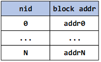
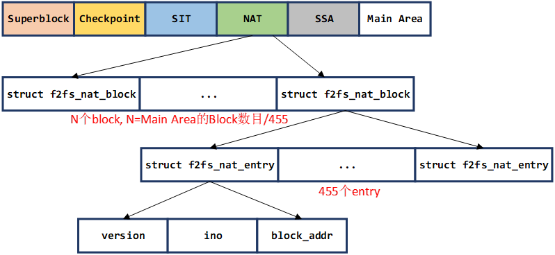

# Node Address Table区域-NAT结构

Node Address Table，简称NAT，是F2FS用于集中管理node的结构。它的主要维护了一张表(如下图)，记录了每一个node在flash设备的物理地址。F2FS给每一个node分配了一个node ID(nid)，系统可以根据nid从NAT查找到该node在flash设备上的物理地址，然后从flash设备读取出来。



##  NAT在元数据区域的物理结构



如上图所示，NAT区域由N个`struct f2fs_nat_block`组成，每一个`struct f2fs_nat_block`包含了455个`struct f2fs_nat_entry`。每一个nid对应了一个entry，每一个entry记录了这个node的在flash设备上的物理地址block_addr。同时entry也记录了一个ino的值，这个值用于找到这个node的parent node，如果nid=ino则表示这个node是inode，如果nid != ino，则表示这是一个direct_node或者indrect_node(node的概念参考第二章的第一节)。version变量用于系统恢复。


## NAT内存管理结构

NAT在内存中对应的管理结构是`struct f2fs_nm_info`，它在` build_node_manager`函数进行初始化(如下)。`struct f2fs_nm_info`不会将所有的NAT的数据都读取出来，而是读取NAT的一部分，然后构建free nid表，用于给新的node分配nid。

```c
int build_node_manager(struct f2fs_sb_info *sbi)
{
	int err;

    /* 分配空间 */
	sbi->nm_info = kzalloc(sizeof(struct f2fs_nm_info), GFP_KERNEL);
	if (!sbi->nm_info)
		return -ENOMEM;

    /* 初始化sbi->nm_info的信息 */
	err = init_node_manager(sbi);
	if (err)
		return err;

    /* 构建free nids表，用于给新的node分配nid */
	build_free_nids(sbi);
	return 0;
}
```

`init_node_manager`函数主要用于初始化`sbi->nm_info`内的变量信息:

```c
static int init_node_manager(struct f2fs_sb_info *sbi)
{
	struct f2fs_super_block *sb_raw = F2FS_RAW_SUPER(sbi);
	struct f2fs_nm_info *nm_i = NM_I(sbi);
	unsigned char *version_bitmap;
	unsigned int nat_segs, nat_blocks;

    /* NAT表在flash设备的起始物理地址 */
	nm_i->nat_blkaddr = le32_to_cpu(sb_raw->nat_blkaddr);

	/* segment_count_nat includes pair segment so divide to 2. */
	nat_segs = le32_to_cpu(sb_raw->segment_count_nat) >> 1;
    
    /* NAT区域包含了多少个block，从nm_i->nat_blkaddr开始的nat_blocks就是NAT表的存储空间 */
	nat_blocks = nat_segs << le32_to_cpu(sb_raw->log_blocks_per_seg);

    /* 最大的nid的值 */
	nm_i->max_nid = NAT_ENTRY_PER_BLOCK * nat_blocks;

	/* not used nids: 0, node, meta, (and root counted as valid node) */
	nm_i->available_nids = nm_i->max_nid - F2FS_RESERVED_NODE_NUM;
	nm_i->fcnt = 0;
	nm_i->nat_cnt = 0;
	nm_i->ram_thresh = DEF_RAM_THRESHOLD;
	nm_i->ra_nid_pages = DEF_RA_NID_PAGES;
	nm_i->dirty_nats_ratio = DEF_DIRTY_NAT_RATIO_THRESHOLD;

    /* list + radix tree就是构建了类似 HashMap的索引结构，用于缓存free nid的entry */
	INIT_RADIX_TREE(&nm_i->free_nid_root, GFP_ATOMIC);
	INIT_LIST_HEAD(&nm_i->free_nid_list);
	INIT_RADIX_TREE(&nm_i->nat_root, GFP_NOIO);
	INIT_RADIX_TREE(&nm_i->nat_set_root, GFP_NOIO);
	INIT_LIST_HEAD(&nm_i->nat_entries);

	mutex_init(&nm_i->build_lock);
	spin_lock_init(&nm_i->free_nid_list_lock);
	init_rwsem(&nm_i->nat_tree_lock);

    /* 每次一次分配nid的时候，就会更新这个next_scan_nid的值，下次就可以从这里开始搜索 */
	nm_i->next_scan_nid = le32_to_cpu(sbi->ckpt->next_free_nid);
	nm_i->bitmap_size = __bitmap_size(sbi, NAT_BITMAP);
	version_bitmap = __bitmap_ptr(sbi, NAT_BITMAP);
	if (!version_bitmap)
		return -EFAULT;

	nm_i->nat_bitmap = kmemdup(version_bitmap, nm_i->bitmap_size,
					GFP_KERNEL);
	if (!nm_i->nat_bitmap)
		return -ENOMEM;
	return 0;
}
```

`build_free_nids`主要用于构建free nid表，用于给新的node分配nid。 为了节省内存，F2FS不会将NAT中所有的free nid读取出来，只会读取一部分，因此使用`nm_i->fcnt`表示缓存了多少个free nid。然后会读取一定的数目的`f2fs_nat_block`出来，并遍历其中的每一个`f2fs_nat_entry`，加入到free nid的管理结构中。最后还会搜索一下log区域的free nid信息(参考Checkpoint区域一节)，也加入到free nid管理结构中。

```c
void build_free_nids(struct f2fs_sb_info *sbi)
{
	struct f2fs_nm_info *nm_i = NM_I(sbi);
	struct curseg_info *curseg = CURSEG_I(sbi, CURSEG_HOT_DATA);
	struct f2fs_journal *journal = curseg->journal;
	int i = 0;
	nid_t nid = nm_i->next_scan_nid; // next_scan_nid的含义上面有介绍，从这里开始搜索free nid

	/* *
	 * 为了节省内存，F2FS不会将NAT中所有的free nid读取出来，只会读取一部分
	 * fcnt表示目前缓存了多少个free nid，如果大于NAT_ENTRY_PER_BLOCK，则不再缓存了
	 */
	if (nm_i->fcnt >= NAT_ENTRY_PER_BLOCK)
		return;

	/* 
	 * 因为准备开始读取NAT的page(block)，因此根据nid(next_scan_nid)的所在的block开始，
	 * 读取FREE_NID_PAGES(=8)个page进入内存 
	 */
	ra_meta_pages(sbi, NAT_BLOCK_OFFSET(nid), FREE_NID_PAGES,
							META_NAT, true);

	down_read(&nm_i->nat_tree_lock);

	while (1) {
		struct page *page = get_current_nat_page(sbi, nid);

        /* 
         * 读取当前nid所在的f2fs_nat_block(page)，
         * 然后将free nid加入到nm_i->free_nid_list/root中 
         */
		scan_nat_page(sbi, page, nid);
        
        /* 释放当前的f2fs_nat_block对应的page */
		f2fs_put_page(page, 1);

        /* 已经读取了一个f2fs_nat_block，自然要跳到下一个f2fs_nat_block的第一个nid */
		nid += (NAT_ENTRY_PER_BLOCK - (nid % NAT_ENTRY_PER_BLOCK));
		if (unlikely(nid >= nm_i->max_nid))
			nid = 0;

        /* 所有block读完之后就跳出循环 */
		if (++i >= FREE_NID_PAGES)
			break;
	}

	/* 更新next_scan_nid，前面的已经扫描过了，下一次从这个nid开始扫描 */
	nm_i->next_scan_nid = nid;

	/* 遍历log的nat_journal记录的nat_entry信息，从中寻找free nid */
	down_read(&curseg->journal_rwsem);
	for (i = 0; i < nats_in_cursum(journal); i++) {
		block_t addr;
		/* 从journal中获取nid信息 */
        nid = le32_to_cpu(nid_in_journal(journal, i));
        /* 从journal中获取该nid对应的物理地址 */
		addr = le32_to_cpu(nat_in_journal(journal, i).block_addr);
        
        /* addr==NULL_ADDR 表示这个nid没有被文件使用，因此加入free nid，否则去除free nid */
		if (addr == NULL_ADDR) 
			add_free_nid(sbi, nid, true);
		else
			remove_free_nid(nm_i, nid);
	}
	up_read(&curseg->journal_rwsem);
	up_read(&nm_i->nat_tree_lock);

	ra_meta_pages(sbi, NAT_BLOCK_OFFSET(nm_i->next_scan_nid),
					nm_i->ra_nid_pages, META_NAT, false);
}
```

`scan_nat_page`函数的作用是扫描当前的`f2fs_nat_block`的每一个entry，并找到其中的free nid，加入到`nm_i`的free nid管理结构中。

```c
static void scan_nat_page(struct f2fs_sb_info *sbi,
			struct page *nat_page, nid_t start_nid)
{
	struct f2fs_nm_info *nm_i = NM_I(sbi);
	struct f2fs_nat_block *nat_blk = page_address(nat_page);
	block_t blk_addr;
	int i;

    /* 找到start_nid的值是属于f2fs_nat_block的第几个entry */
	i = start_nid % NAT_ENTRY_PER_BLOCK;

    /* 
     * 从这个entry开始遍历，
     * 如果blk_addr == NULL_ADDR则通过add_free_nid函数加入free nid的管理结构中，
     * 同时增加nm_i->fcnt的值 
     */
	for (; i < NAT_ENTRY_PER_BLOCK; i++, start_nid++) {

		if (unlikely(start_nid >= nm_i->max_nid))
			break;

		blk_addr = le32_to_cpu(nat_blk->entries[i].block_addr);
		f2fs_bug_on(sbi, blk_addr == NEW_ADDR);
		if (blk_addr == NULL_ADDR) {
			if (add_free_nid(sbi, start_nid, true) < 0)
				break;
		}
	}
}
```

