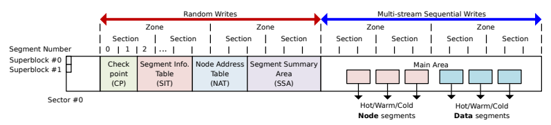

# 总体介绍
F2FS全称为Flash Friendly File System，是专门为flash设备设计的一个日志结构型文件系统(Log-structured File System, LFS)。相对于传统的日志结构型文件系统，F2FS在wandering tree和gc的高时间开销等问题，有一定的改进和优化。

- **wandering tree问题:** 传统的LFS，在文件数据被更新或者写入到日志的末端的时候，指向文件数据保存地址的直接指针指针会被更新(flash设备的异地更新特性)，同时指向这个直接指针的间接指针也会更新，然后保存间接指针的inode、inode blockmap等结构也需要更新，这样就导致了频繁metadata的更新。这种问题称为wandering tree问题。

- **高gc开销问题:** 由于LFS对于修改的数据是执行异地更新的特性，因此数据更新到一个新地址后，旧地址的回收和再利用的过程称为垃圾回收过程(GC)，这个过程会导致不可预期的高延迟，对于用户感知有很大影响。

# 系统特性

### F2FS的基本数据单位
1. **block:** F2FS的数据存储的基本单位是block，大小为4KB，整个flash设备被格式化为多个block组成的结构。很多数据结构也被设计为4KB的大小，这是因为很多flash设备单次IO的读写都是基于4KB的倍数进行。
2. **segment:** segment是管理block的结构，一个segment的大小是512个block，也就是2MB。
3. **section:** 默认情况下一个segment等于一个section，section是GC的基本操作单位，每次GC都会从section中选出特定的segment进行回收。F2FS将section分为了6类，分别是hot-node，warm-node，cold-node，hot-data，warm-data，cold-data，hot->cold表示了数据的从高到低的修改频率，通过不同类型的section，进行gc的时候可针对使用hot的section进行gc，以降低gc的时间开销。
4. **zone:** 默认情况一个zone等于一个section，与物理设备有关，大部分情况下用不上。

### Multi-head Logging特性

Log区域指的是文件系统中用于分配free block(空闲的且没有写入数据的block)的区域，例如F2FS的一个文件需要写入新数据，它就要去Log区域请求free block，然后再将数据写入这个free block中。传统的LFS往往会维护一个大的日志区域，一切数据的分配都从这个大的日志区域中进行处理，而F2FS则根据数据的访问冷热特性差异，维护了6个Log区域，分别是:

- **HOT NODE区域**：给目录的direct node使用，因为打开目录、读取目录是最频繁的操作。
- **WARM NODE区域**：给普通文件的direct node使用
- **COLD NODE区域**：给indirect node使用，一般而言只有较大的文件才会使用到这个log区域。
- **HOT DATA区域**：给目录的数据使用，目录数据记录了当前目录有多少个子文件、子文件夹。
- **WARM DATA区域**：给普通文件的数据使用，常规的fwrite/write函数写入的数据都是在这里分配。
- **COLD DATA区域**：给不频繁修改的数据使用，如多媒体文件(多为只读文件)，或者用户指定的只读文件，如GC产生写的数据(gc会挑热度最低的数据)。

*注: direct node、indirect node的概念和作用会在第二章进行介绍。*

# F2FS的闪存设备物理区域布局

通过mkfs.f2fs工具，可以将整个flash设备格式化成特定的格式。整个存储设备区域被F2FS格式化为6个区域，分别是Superblock，Checkpoint，Segment Info Table，Node Address Table，Segment Summary Area，以及Main Area。前5个区域总称为元数据区域(Metadata Area)，保存的是跟F2FS直接相关的元信息，而最后一个区域是保存文件数据的主要区域，主要保存了node数据、文件data数据、目录数据。它们的作用分别是:

**Superblock:** 记录整个文件系统的分区信息，包括一共有多少个block，使用了多少block这些最基本同时也是最重要的信息。F2FS在挂载的时候，会创建一个内存数据结构`struct f2fs_sb_info`，然后从设备的Superblock区域读取相关数据。

**Checkpoint:** 记录了上次卸载F2FS的时刻，系统的block、node等分配状态(如当前free block分配了到哪个位置)，用于给下次挂载F2FS的时候，复原整个系统的block、node的分配状态。在F2FS的运行过程中，F2FS会定时将当前的block、node分配状态写入Checkpoint区域，用于由于F2FS被关闭/崩溃时恢复数据。Checkpoint在内存中对应的数据结构是`struct f2fs_checkpoint`。

**Segment Information Table(SIT):** 保存了每一个segment的信息，例如这个segment已经分配了多少个block、哪一个block正在使用，哪一个block是无效的需要回收。通过这些信息去管理已经被使用了的block和未使用的block，使系统可以合理分配block。每一个segment都对应了一个segment number(segno)，系统可以通过segno快速地查询到该segment的分配信息。SIT在内存中对应的数据结构是`struct f2fs_sm_info`。

**Node Address Table(NAT):** 建立了一张表保存了每一个node的物理地址信息。F2FS的每一个node都有一个node id(nid)，系统可以通过nid在NAT找到对应node的物理地址，从而在闪存设备读取出来。NAT在内存中对应的数据结构是`struct f2fs_nm_info`。

**Segment Summary Area(SSA):** 这个区域主要保存了jounal(SIT/NAT临时的修改信息)以及summary(记录了逻辑地址和物理地址关系的结构，主要用与GC)。SSA区域在内存中没有专门的数据结构。

**Main Area:** Main Area被4KB大小的block所填充，这些block可以分配给文件的data或者文件的node，是F2FS的主要数据保存区域。

