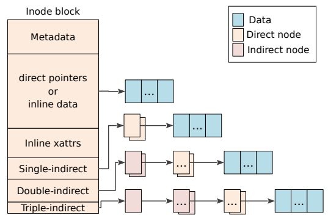

# 文件数据的保存以及物理地址的映射
文件数据的组织方式一般时被设计为inode-data模式，即 每一个文件都具有一个inode，这个inode记录data的组织关系，这个关系称为**文件结构**。例如用户需要访问A文件的第1000个字节，系统就会先根据A文件的路径找到的A的inode，然后从inode找到第1000个字节所在的物理地址，然后从磁盘读取出来。那么F2FS的文件结构是怎么样的呢?



如上图，F2FS中的一个inode，包含两个主要部分: metadata部分，和数据块寻址部分。我们重点观察数据块寻址部分，分析inode时如何将数据块索引出来。在图中，数据块寻址部分包含direct pointers，single-indirect，double-indirect，以及triple-indirect。它们的含义分别是：

**direct pointer:** inode内直接指向数据块(图右上角Data)的地址数组，即**inode->data模式**。

**single-indirect pointer:** inode记录了两个single-indirect pointer(图右上角Direct node)，每一个single-indirect pointer存储了多个数据块的地址，即**inode->direct_node->data模式**。

**double-indirect:** inode记录了两个double-indirect pointer(图右上角indirect node)，每一个double-indirect pointer记录了许多single-indirect pointer，每一个single-indirect pointer指向了数据块，即**inode->indirect_node->direct_node->data模式**。

**triple-indirect:** inode记录了一个triple-indirect pointer(图右上角indirect node)，每一个triple-indirect pointer记录了许多double-indirect pointer，每一个double-indirect pointer记录了许多single-indirect pointer，最后每一个single-indirect pointer指向了数据块。即**inode->indirect_node->indirect_node->direct_node->data模式**。

因此，我们可以发现，F2FS的inode结构采取indirect_node，首先在inode内部寻找物理地址，如果找不到再去direct_node找，层层深入。

## f2fs_node的结构以及作用
根据上面的分析，我们可以发现一个对于一个较大的文件，它可能包含inode以外的node，去保存一些间接寻址的信息。single-indirect pointer记录的是数据块的地址，而double-indirect pointer记录的是single-indirect pointer的地址，triple-indirect pointer记录的double-indirect pointer地址。在F2FS中，

inode对应的是`f2fs_inode`结构，包含了多个direct pointer指向数据块物理地址；

single-indirect pointer对应的是`direct_node`结构，包含了多个direct pointer指向物理地址；

double-indirect pointer对应的是`indirect_node`结构，包含了多个指向`direct_node`的地址；

triple-indirect pointer对应的也是`indirect_node`结构，包含了多个指向`indirect_node`的地址

接下来我们逐个分析F2FS每一个node的具体数据结构。


### 基本node结构

为了方便F2FS的对node的区分和管理，`f2fs_inode`和`direct_node`以及`indirect_node`都使用了同一个数据结构`f2fs_node`进行描述，并通过union的方式，将`f2fs_node`初始化成不同的node形式，它的结构如下:

```c
struct f2fs_node {
	union {
		struct f2fs_inode i;
		struct direct_node dn;
		struct indirect_node in;
	};
	struct node_footer footer; // footer用于记录node的类型
} __packed;

struct node_footer {
	__le32 nid;		/* node id */
	__le32 ino;		/* inode nunmber */
	__le32 flag;		/* include cold/fsync/dentry marks and offset */
	__le64 cp_ver;		/* checkpoint version */
	__le32 next_blkaddr;	/* next node page block address */
} __packed;
```
其中起到区分是哪一种node的关键数据结构是`node_footer`。如果`node_footer`的`nid`和`ino`相等，则表示这是一个`f2fs_inode`结构，如果不相等，则表示这是一个`direct_node`或者`indirect_node`。


### f2fs_inode结构

我们先看`f2fs_inode`的结构，省略其他元数据的信息，重点关注文件如何索引的，结构如下:

```c
struct f2fs_inode {
	...
	__le32 i_addr[DEF_ADDRS_PER_INODE]; // DEF_ADDRS_PER_INODE=923
	__le32 i_nid[DEF_NIDS_PER_INODE];	// DEF_NIDS_PER_INODE=5
	...
} __packed;
```

`i_addr`数组就是前面提及的direct pointer，数组的下标是文件的逻辑位置，数组的值就是flash设备的物理地址。例如文件的第一个页就对应`i_addr[0]`，第二个页就对应`i_addr[1]`，而`i_addr[0]`和`i_addr[1]`所记录的物理地址，就是文件第一个页(page)和第二个页的数据的物理地址，系统可以将两个物理地址提交到flash设备，将数据读取出来。

我们可以发现`i_addr`的数组长度只有923，即一个`f2fs_inode`只能直接索引到923个页/块的地址(约3.6MB)，对于大于3.6MB的文件，就需要使用**间接寻址**。`f2fs_inode`的`i_nid`数组就是为了间接寻址而设计，`i_nid`数组是一个长度为5的数组，可以记录5个node的地址。其中

`i_nid[0]`和`i_nid[1]`记录的是`direct_node`的地址，即对应前述的single-indirect pointer。

`i_nid[2]`和`i_nid[3]`记录的是`indirect_node`的地址，这两个`indirect_node`记录的是`direct_node`的地址，即对应前述的double-indirect pointer。

`i_nid[4]`记录的是`indirect_node`的地址，但是这个`indirect_node`记录的是`indirect_node`的地址，即前述的triple-indirect pointer。


### direct_node和indirect_node结构

`direct_inode`以及`indirect_inode`的结构如下所示，`direct_node`记录的是数据块的地址，`indirect_inode`记录的是node的id，系统可以通过nid找到对应的node的地址。

```c
struct direct_node {
	__le32 addr[ADDRS_PER_BLOCK]; // ADDRS_PER_BLOCK=1018
} __packed;

struct indirect_node {
	__le32 nid[NIDS_PER_BLOCK]; // NIDS_PER_BLOCK=1018
} __packed;
```


### Wandering Tree问题

在第一章的第一节提到，F2FS的设计是为了解决wandering tree的问题，那么现在的设计是如何解决这个问题的呢。假设一个文件发生更改，修改了`direct_node`里面的某一个block的数据，根据LFS的异地更新特性，我们需要给更改后的数据一个新的block。传统的LFS需要将这个新的block的地址一层层网上传递，直到inode结构。而F2FS的设计是只需要将`direct_node`对应位置的`addr`的值更新为新block的地址，从而没必要往上传递，因此解决了wandering tree的问题。


## 普通文件数据的保存

从上节描述可以知道，一个文件由一个`f2fs_inode`和多个`direct_inode`或者`indirect_inode`所组成。当系统创建一个文件的时候，它会首先创建一个`f2fs_inode`写入到flash设备，然后用户往该文件写入第一个page的时候，会将数据写入到main area的一个block中，然后将该block的物理地址赋值到`f2fs_inode->i_addr[0]`中，这样就完成了Node-Data的管理关系。随着对同一文件写入的数据的增多，会逐渐使用到其他类型的node去保存文件的数据。

经过上面的分析，我们可以计算F2FS单个文件的最大尺寸:
1. `f2fs_inode` 直接保存了923个block的数据的物理地址
2. `f2fs_inode->i_nid[0~1]` 保存了两个 `direct_node` 的地址，这里可以保存 2 x 1018个block的数据
3. `f2fs_inode->i_nid[2~3]` 保存了两个`indirect_node` 的地址，这两个其中2个`indirect_node`保存的是 `direct_node` 的nid，因此可以保存 2 x 1018 x 1018个block的数据;
4. `f2fs_inode->i_nid[4]` 保存了一个`indirect_node` 的地址，这个`indirect_node`保存的是 `indirect_node` 的nid，因此可以保存 1018 x 1018 x 1018个页的数据

可以得到如下计算公式: 
**4KB x (923 + 2 x 1018 + 2 x 1018 x 1018 + 1 x 1018 x 1018 x 1018) = 3.93TB**
因此F2FS单个文件最多了保存3.93TB数据。


## 内联文件数据的保存

从上节可以知道，文件的实际数据是保存在`f2fs_inode->i_addr`对应的物理块当中，因此即使一个很小的文件，如1个字节的小文件，也需要一个node和data block才能实现正常的保存和读写，也就是需要8KB的磁盘空间去保存一个尺寸为1字节的小文件。而且`f2fs_inode->i_addr[923]`里面除了`f2fs_inode->i_addr[0]`保存了一个物理地址，其余的922个i_addr都被闲置，造成了空间的浪费。

因此F2FS为了减少空间的使用量，使用内联(inline)文件减少这些空间的浪费。它的核心思想是当文件足够小的时候，使用`f2fs_inode->i_addr`数组直接保存数据本身，而不单独写入一个block中，再进行寻址。因此，如上面的例子，只有1个字节大小的文件，只需要一个`f2fs_inode`结构，即4KB，就可以同时将node信息和data信息同时保存，减少了一半的空间使用量。

根据上述定义，可以计算得到多大的文件可以使用内联的方式进行保存，`f2fs_inode`有尺寸为923的用于保存数据物理地址的数组i_addr，它的数据类型是__le32，即4个字节。保留一个数组成员另做它用，因此内联文件最大尺寸为: 922 * 4 = 3688字节。


## 文件读写与物理地址的映射的例子

Linux的文件是通过page进行组织起来的，默认page的size是4KB，使用index作为编号。


**一个小文件访问例子**

例如一个size=10KB的文件，需要3个page去保存数据，这3个page的编号是0，1，2。当用户访问这个文件的第2~6kb的数据的时候，系统就会计算出数据保存在page index = 0和1的page中，然后根据文件的路径找到对应的`f2fs_inode`结构，page index = 0和1即对应`f2fs_inode`的`i_addr[0]`和`i_addr[1]`。系统进而从这两个`i_addr`读取物理地址，提交到flash设备将数据读取出来。


**一个大文件访问例子**

假设用户需要读取文件第4000个页(page index = 3999)的数据，
第一步: 那么首先系统会根据文件路径找到对应的f2fs_inode结构
第二步: 由于4000 >（923 + 1018 + 1018），`f2fs_inode->i_addr`和`f2fs_inode->nid[0]和nid[1]`都无法满足需求，因此系统根据`f2fs_inode->nid[2]`找到对应的 `indirect_node`的地址
第三步: `indirect_node`保存的是`direct_node`的nid数组，由于 4000 - 923 - 1018 - 1018 = 1041，而一个`direct_node`只能保存1018个block，因此可以知道数据位于`indirect_node->nid[1]`对应的`direct_node`中
第四步: 计算剩下的的偏移(4000-923-1018-1018-1018=23)找到数据的物理地址位于该`direct_node`的`direct_node->addr[23]`中。


